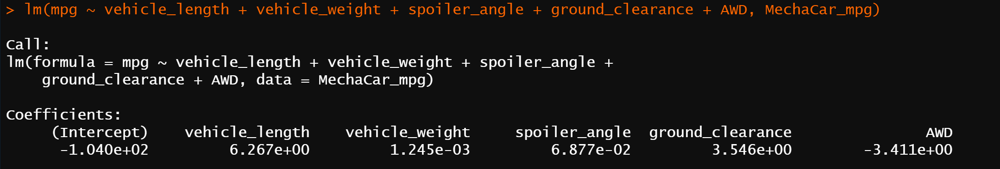
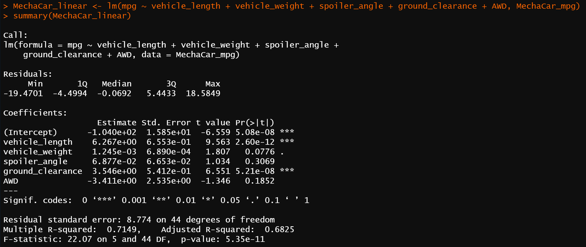
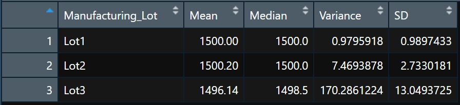
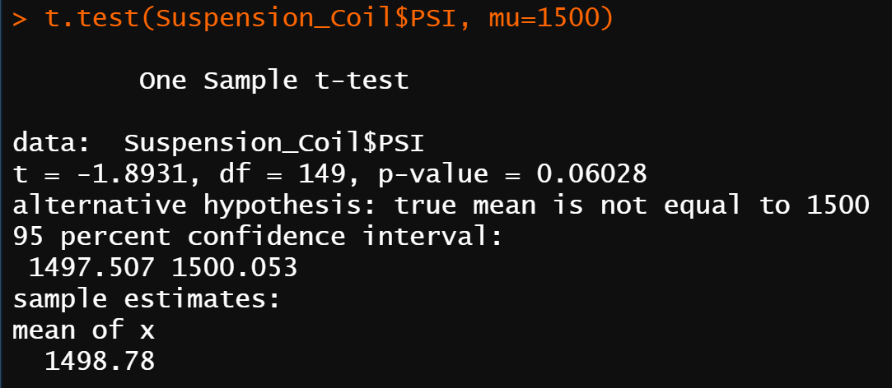
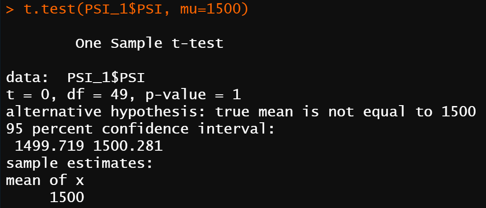
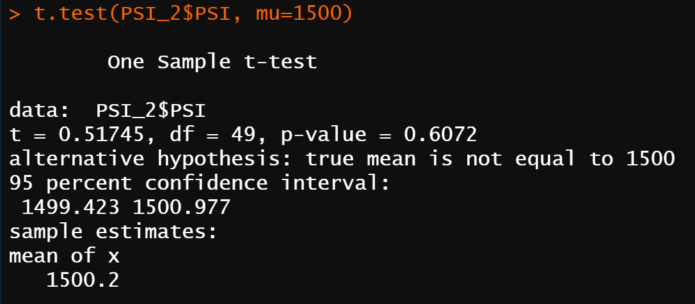
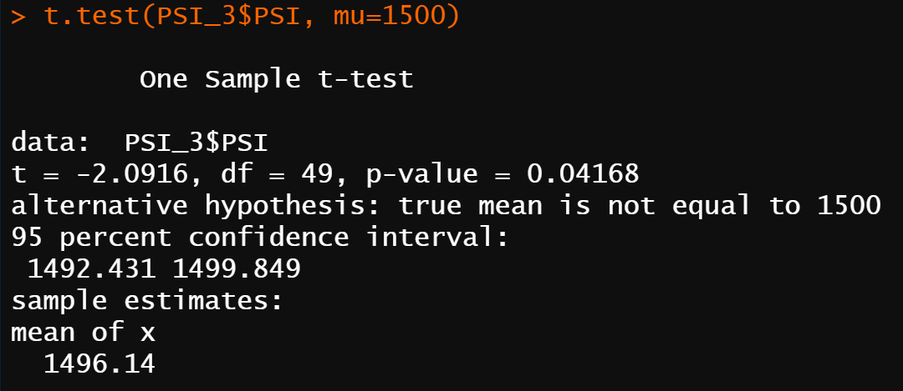

# MechaCar_Statistical_Analysis
R, RStudio, tidyverse library collections, jsonlite library, ggplot2 library, t-test (Student’s t-test, one sample t-test, two-sample t-test, paired t-test), ANOVA test, linear regression, multiple linear regression, Pearson’s Chi-squared test, A/B Testing
## Linear Regression to Predict MPG
1. The item "vehicle_length" and "ground_clearance" will provide a non-random amount of variance as the p-value for these two items are below 0.05
2. No, the slope of the linear model should not be considered to be zero as the slope of the linear model is composed of five different values according to the screen capture below. And the slope values for three out five items are greater than zero (p-value is smaller than 0.05) meaning such item has effects to the dependent variable (mpg).  
3. It can be observed that the R-squared value (Multiple R-squared: 0.7149, Adjusted R-squared: 0.6825) reasonably explains a decent percentage of data points that could describe such dependent results through this linear model. Therefore, the linear model predicts the mpg of MechaCar prototypes effectively. 
  
  
## Summary Statistics on Suspension Coils
Overall, the variance across all the manufacturing lots is around 62.3, which satisfies the design specification. For each individual lot, manufacturing lot #1 and lot #2 satisfies the design specification. Manufacturing lot #3 exceeds the variance design specification and reaches around 170.  
  
  
## T-Tests on Suspension Coils
If we determine the level of significance is 0.05.  
All manufacturing lots generally are not statistically different from the population mean of 1,500 pounds per square inch as the p-value is larger than the threshold.  
Manufacturing lot #1 and lot #2 are not statistically different from the population mean as the p-values for these two items are much larger than the threshold.  
Manufacturing lot #3 is statistically different from the population mean as the p-value is smaller than the threshold.  

  

  
## Study Design: MechaCar vs Compeition
A study is planned to conduct and explore the relationship between the maintenance cost of cars with and without AWD.  
1. For the competition, the metric to test is the maintenance cost categorized by w/wo AWD cars.  
2. Null hypothesis: Cars with AWD or without AWD have the same maintenance cost.  
Alternative hypothesis: Cars with AWD have different maintenance cost compared to the ones without AWD.  
3. The statistical test used in this case is the ANOVA test as the test is to explore the mean difference between different categorical groups (in this case, AWD and without AWD). The p-value calculated can be used to determine if the null hypothesis is acceptable or not.  
4. The data needed is the column of monthly maintenance fee for each vehicle in the MechaCar_mpg dataset.  
